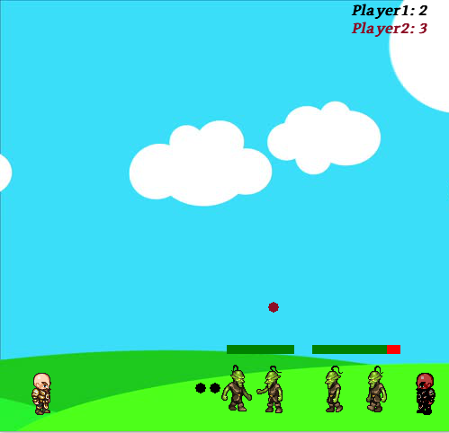
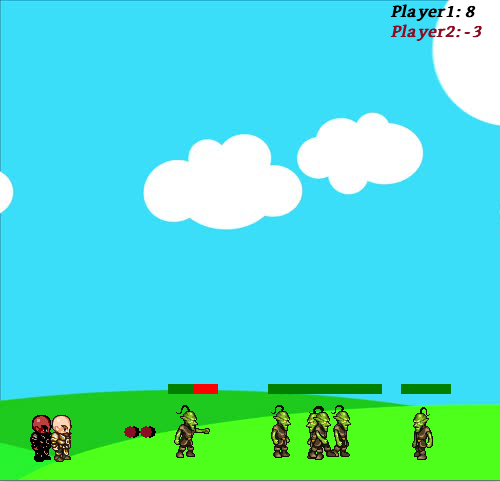
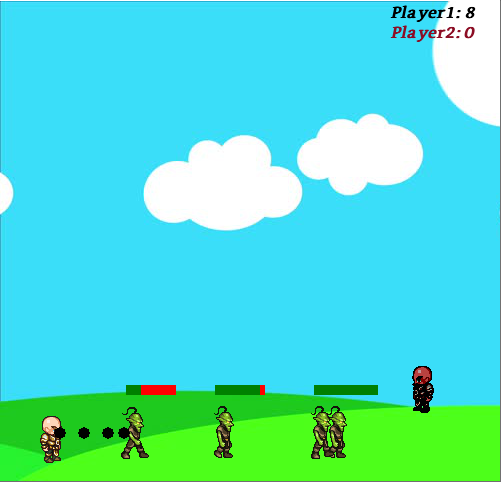

# Játékfejlesztés pygame segítségével
## Bevezető
A program egy egyszerű 2 dimenziós játék. Két karakter irányítható, így ketten játszható. 

A következő funkciók lettek megvalósítva:
* A karakterrel való mozgás
* A karakterrel való ugrás
* A karakterrel való lövés
* Folyamatosan újraéledő ellenfelek
* Pontrendszer
* Az ellenfeleket le lehet lőni, ha hozájuk érünk pontot vesztünk
* Játék során zene lejátszása
* Hangeffektek lövéskor és találatkor

A projekt egy .py filet és egy mappányi egyéb fájlt tartalmaz.

használt könyvtárak:
* pygame
* random

    

  



## A program felépítése

###Szükséges fájlok importálása
A programhoz szükséges fájlokat a program elején importáljuk. Ezek egy külön 'Game' nevü mappában találhatóak meg.

```python

win = pygame.display.set_mode((500, 480))

pygame.display.set_caption("First Game")

walkRight = [pygame.image.load('.\\Game\\R1.png'), pygame.image.load('.\\Game\\R2.png'), pygame.image.load('.\\Game\\R3.png'), pygame.image.load('.\\Game\\R4.png'), pygame.image.load('.\\Game\\R5.png'), pygame.image.load('.\\Game\\R6.png'), pygame.image.load('.\\Game\\R7.png'), pygame.image.load('.\\Game\\R8.png'), pygame.image.load('.\\Game\\R9.png')]
walkLeft = [pygame.image.load('.\\Game\\L1.png'), pygame.image.load('.\\Game\\L2.png'), pygame.image.load('.\\Game\\L3.png'), pygame.image.load('.\\Game\\L4.png'), pygame.image.load('.\\Game\\L5.png'), pygame.image.load('.\\Game\\L6.png'), pygame.image.load('.\\Game\\L7.png'), pygame.image.load('.\\Game\\L8.png'), pygame.image.load('.\\Game\\L9.png')]
bg = pygame.image.load('.\\Game\\bg.jpg')
char = pygame.image.load('.\\Game\\standing.png')

walkRight1 = [pygame.image.load('.\\Game\\R1_2.png'), pygame.image.load('.\\Game\\R2_2.png'), pygame.image.load('.\\Game\\R3_2.png'), pygame.image.load('.\\Game\\R4_2.png'), pygame.image.load('.\\Game\\R5_2.png'), pygame.image.load('.\\Game\\R6_2.png'), pygame.image.load('.\\Game\\R7_2.png'), pygame.image.load('.\\Game\\R8_2.png'), pygame.image.load('.\\Game\\R9_2.png')]
walkLeft1 = [pygame.image.load('.\\Game\\L1_2.png'), pygame.image.load('.\\Game\\L2_2.png'), pygame.image.load('.\\Game\\L3_2.png'), pygame.image.load('.\\Game\\L4_2.png'), pygame.image.load('.\\Game\\L5_2.png'), pygame.image.load('.\\Game\\L6_2.png'), pygame.image.load('.\\Game\\L7_2.png'), pygame.image.load('.\\Game\\L8_2.png'), pygame.image.load('.\\Game\\L9_2.png')]
char1 = pygame.image.load('.\\Game\\standing_2.png')

clock = pygame.time.Clock()

bulletSound = pygame.mixer.Sound('.\\Game\\Grenade-SoundBible.com-1777900486.wav')
hitSound = pygame.mixer.Sound('.\\Game\\Batman Punch-SoundBible.com-456755860.wav')


music = pygame.mixer.music.load('.\\Game\\music.mp3')
pygame.mixer.music.play(-1)


```
### A program 3 osztályt tartalmaz

A player osztályt, melyben a játékoshoz köthető funkciók vannak megvalósítva, ide tartoznak a játékos változói, a kirajzoláshoz szükséges dolgok és az ellengelekkel való érintkezés lekezelése.

```python
class player(object):
    def __init__(self, x, y, width, height, walkRight, walkLeft, char):
        self.x = x
        self.y = y
        self.width = width
        self.height = height
        self.vel = 5
        self.isJump = False
        self.jumpCount = 10
        self.left = False
        self.right = False
        self.walkCount = 0
        self.walkRight = walkRight
        self.walkLeft = walkLeft
        self.char = char
        self.standing = True
        self.hitbox = (self.x +17, self.y + 11, 29, 52)
        self.shootLoop = 0
        self.score = 0

        
    def Shoot_Loop(self):
        if self.shootLoop >  0:
            self.shootLoop +=1
        if self.shootLoop > 3:
            self.shootLoop = 0
             
    def draw(self, win):
            if self.walkCount + 1 >= 27:
                self.walkCount = 0
             
            if not(self.standing):    
                if self.left: 
                    win.blit(self.walkLeft[self.walkCount//3], (self.x,self.y))
                    self.walkCount += 1
                elif self.right:
                    win.blit(self.walkRight[self.walkCount//3], (self.x,self.y))
                    self.walkCount += 1
            else:
                if self.right:
                    win.blit(self.walkRight[0], (self.x, self.y))
                else:
                    win.blit(self.walkLeft[0], (self.x, self.y))
                    
            self.hitbox = (self.x +17, self.y + 11, 29, 52)        
            #pygame.draw.rect(win, (255,0,0), self.hitbox,2)   
       
    def touch(self):
        self.jumpCount = 77
        self.x = 60
        self.y = 400
        self.walkCount = 0
        font1 = pygame.font.SysFont('bookerly', 100)
        text = font1.render('-5', 1, (255, 0, 0))
        win.blit(text, (250 - (text.get_width()/2), 200))
        pygame.display.update()
        i = 0
        while i < 30:
            pygame.time.delay(1)
            i += 1
            for event in pygame.event.get():
                if event.type == pygame.QUIT:
                    i = 31
                    pygame.quit()   

```

A következő osztály az enemy osztály, az ellenfeleket egy tömbben tároljuk el, melyek elemei ilyen típusuak. Hasonló tartalommal rendelkezik, mint a player osztály, de ezeket nem mi irányítjuk, hanem egy random tengelyen mozognak.

```python
class enemy(object):
    walkRight = [pygame.image.load('.\\Game\\R1E.png'), pygame.image.load('.\\Game\\R2E.png'), pygame.image.load('.\\Game\\R3E.png'), pygame.image.load('.\\Game\\R4E.png'), pygame.image.load('.\\Game\\R5E.png'), pygame.image.load('.\\Game\\R6E.png'), pygame.image.load('.\\Game\\R7E.png'), pygame.image.load('.\\Game\\R8E.png'), pygame.image.load('.\\Game\\R9E.png'), pygame.image.load('.\\Game\\R10E.png'), pygame.image.load('.\\Game\\R11E.png')]
    walkLeft = [pygame.image.load('.\\Game\\L1E.png'), pygame.image.load('.\\Game\\L2E.png'), pygame.image.load('.\\Game\\L3E.png'), pygame.image.load('.\\Game\\L4E.png'), pygame.image.load('.\\Game\\L5E.png'), pygame.image.load('.\\Game\\L6E.png'), pygame.image.load('.\\Game\\L7E.png'), pygame.image.load('.\\Game\\L8E.png'), pygame.image.load('.\\Game\\L9E.png'), pygame.image.load('.\\Game\\L10E.png'), pygame.image.load('.\\Game\\L11E.png')]        
   
    def __init__(self, x, y, width, height, end):
        self.x = x
        self.y = y
        self.width = width
        self.height = height
        self.end = end
        self.path = [self.x, self.end]
        self.walkCount = 0
        self.vel = 3
        self.hitbox = (self.x +17, self.y + 2, 31, 57)
        self.health = 10
        self.visible = True
        
    def draw(self, win):
        self.move()
        if self.visible:
            if self.walkCount + 1 >= 33:
                self.walkCount = 0
            
            if self.vel > 0:
                win.blit(self.walkRight[self.walkCount // 3], (self.x,self.y))
                self.walkCount +=1
            else: 
                win.blit(self.walkLeft[self.walkCount // 3], (self.x,self.y))
                self.walkCount +=1
            self.hitbox = (self.x +17, self.y + 2, 31, 57)
            pygame.draw.rect(win, (255, 0, 0), (self.hitbox[0], self.hitbox[1] - 20, 50, 10)) 
            pygame.draw.rect(win, (0, 128, 0), (self.hitbox[0], self.hitbox[1] - 20, (self.health * 50) // 10, 10))        
            #pygame.draw.rect(win, (255,0,0), self.hitbox,2)  
            
    def isHitted(self, bullet, bullets, player):
        if bullet.y + bullet.radius < self.hitbox[1] + self.hitbox[3] and bullet.y + bullet.radius > self.hitbox[1]:
            if bullet.x + bullet.radius > self.hitbox[0] and bullet.x - bullet.radius < self.hitbox[0] + self.hitbox[2]:
                self.hit(player)                
                try: bullets.pop(bullets.index(bullet))  
                except ValueError:
                    pass

    
    def move(self):
        if self.vel > 0:
            if self.x + self.vel < self.path[1]:
                self.x += self.vel
            else: 
                self.vel = self.vel * -1
                self.walkCount = 0
        else:
            if self.x - self.vel > self.path[0]:
                self.x += self.vel
            else: 
                self.vel = self.vel * -1
                self.walkCount = 0
                
    def hit(self, player):
        hitSound.play()
        player.score += 1
        if self.health >0:
            self. health -= 1


```

Az utolsó osztály a projectile osztály, a játékos által kilőtt lövedékeket ilyen típusúak.

```python
class projectile(object):
    def __init__(self, x, y, radius, color, facing):
        self.x = x
        self.y = y
        self.radius = radius
        self.color = color
        self.facing = facing
        self.vel = 8 * facing    

    def draw(self, win):
        pygame.draw.circle(win, self.color, (self.x,self.y), self.radius)      
```

### Szükséges függvények

A gördülékeny játékmenethez még pár további függvény szükséges

A redrawGameWindow végzi a kirajzolásokat.

```python
def redrawGameWindow():
    win.blit(bg, (0,0)) 
    text = font.render('Player1: ' + str(player1.score), 1, (0,0,0))
    text2 = font.render('Player2: ' + str(player2.score), 1, (140,14,37))
    win.blit(text, (390, 0))
    win.blit(text2, (390, 20))
    player1.draw(win)
    player2.draw(win)  
    
    
    for goblin in goblins:
        goblin.draw(win)

    for bullet in bullets:
        bullet.draw(win)
    
    for bullet1 in bullets1:
        bullet1.draw(win)
    
    pygame.display.update()
    
```
A check-projectiles feladata a fallal vagy ellenféllel való ütközés detektálása.


```python
def check_projectiles(bullets, player):
   for bullet in bullets:
       
        for goblin in goblins:
           goblin.isHitted(bullet, bullets, player)

                
       
        if bullet.x < 500 and bullet.x > 0:
            bullet.x += bullet.vel
        else: 
            bullets.pop(bullets.index(bullet)) 
```

A game_master függvény feladata, hogy respawnoljanak az ellenfelek, így végtelenítet játékmenetet kapjunk.

```python
def game_master():
    for goblin in goblins:
        if goblin.health <= 0:
            goblins.pop(goblins.index(goblin)) 
    global cntr 
    cntr += 1
    if cntr >= 100:
        goblins.append(enemy(randint(10, 300), 402, 64, 64, randint(300, 450)))
        cntr = 0

```

Az isTouched felelős a zombikkal való érintkezés detektálásáért.

```python

def isTouched(goblins, player):
                
    for goblin in goblins:
        if player.hitbox[1] < goblin.hitbox[1] + goblin.hitbox[3] and player.hitbox[1] + player.hitbox[3] > goblin.hitbox[1]:
            if player.hitbox[0] + player.hitbox[2] > goblin.hitbox[0] and player.hitbox[0] < goblin.hitbox[0] + goblin.hitbox[2]:
                player.touch()
                player.score -= 5       
```

### Az irányítás

Két játékos van, mellyek irányítása a következő módon néz ki:

player1:
* bal nyíl: balra megy
* jobb nyíl: jobbra megy
* felfele nyíl: ugrik
* Enter: lövedéket lő ki

```python
 if keys[pygame.K_RETURN] and player1.shootLoop == 0:
        bulletSound.play()
        if player1.left:
            facing = -1
        else:
            facing = 1
        if len(bullets) < 5:
            bullets.append(projectile(round(player1.x + player1.width // 2), round(player1.y + player1.height //2), 6, (0,0,0), facing))
    
        player1.shootLoop = 1
    
    
    if keys[pygame.K_LEFT] and player1.x > 0:
        player1.x -= player1.vel 
        player1.left = True
        player1.right = False
        player1.standing = False
    elif keys[pygame.K_RIGHT] and player1.x < (500 - player1.width):
        player1.x += player1.vel
        player1.right = True
        player1.left = False
        player1.standing = False
    else:
        player1.standing = True
        player1.walkCount = 0
    if not (player1.isJump):
       if keys[pygame.K_UP]:
            player1.isJump = True
            player1.walkCount = 0
    else:
        if player1.jumpCount >= -10 and player1.jumpCount != 77:
            neg = 1
            if player1.jumpCount < 0:
                neg = -1
            player1.y -= (player1.jumpCount ** 2) * 0.5 * neg
            player1.jumpCount -= 1
        else: 
            player1.isJump = False
            player1.jumpCount = 10
        
```

player2:
* a: balra megy
* d: jobbra megy
* w: ugrik
* Space: lövedéket lő ki

```python
  #Character 2  
    if keys[pygame.K_SPACE] and player2.shootLoop == 0:
        bulletSound.play()
        if player2.left:
            facing1 = -1
        else:
            facing1 = 1
        if len(bullets1) < 5:
            bullets1.append(projectile(round(player2.x + player2.width // 2), round(player2.y + player2.height //2), 6, (140,14,37), facing1))
            
        player2.shootLoop = 1    
     
    if keys[pygame.K_a] and player2.x > 0:
        player2.x -= player2.vel
        player2.left = True
        player2.right = False
        player2.standing = False
    elif keys[pygame.K_d] and player2.x < (500 - player2.width):
        player2.x += player2.vel
        player2.right = True
        player2.left = False
        player2.standing = False
    else:
        player2.standing = True 
        player2.walkCount = 0
    if not (player2.isJump):    
        if keys[pygame.K_w]:
            player2.isJump = True
            player2.walkCount = 0
    else:
        if player2.jumpCount >= -10 and player2.jumpCount != 77:
            neg1 = 1
            if player2.jumpCount < 0:
                neg1 = -1
            player2.y -= (player2.jumpCount ** 2) * 0.5 * neg1
            player2.jumpCount -= 1
        else: 
            player2.isJump = False
            player2.jumpCount = 10
```
